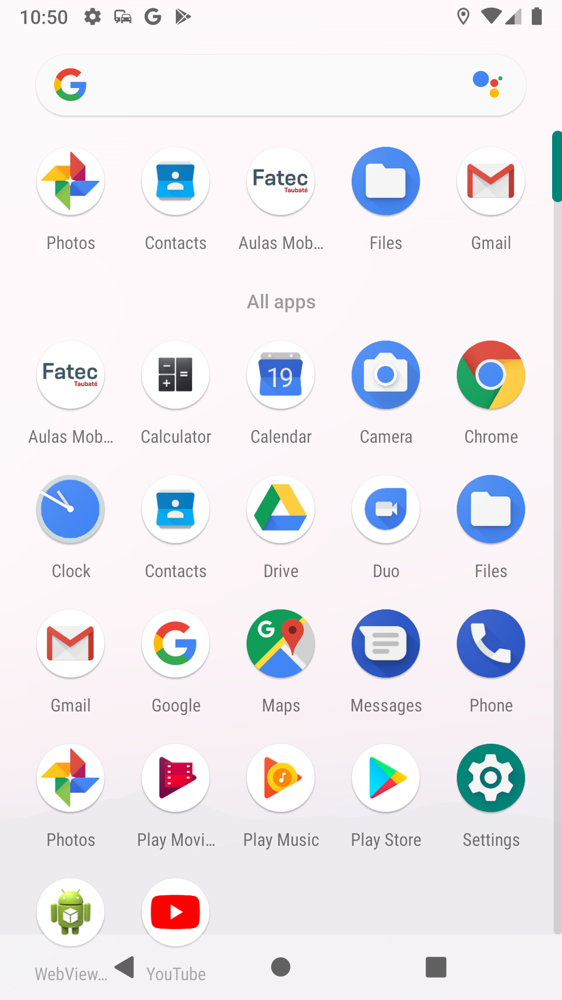
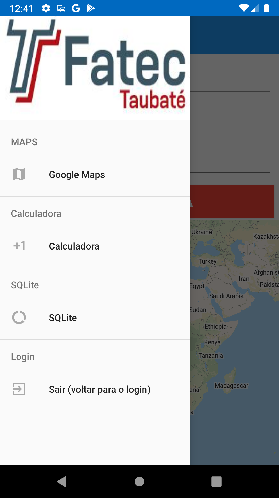
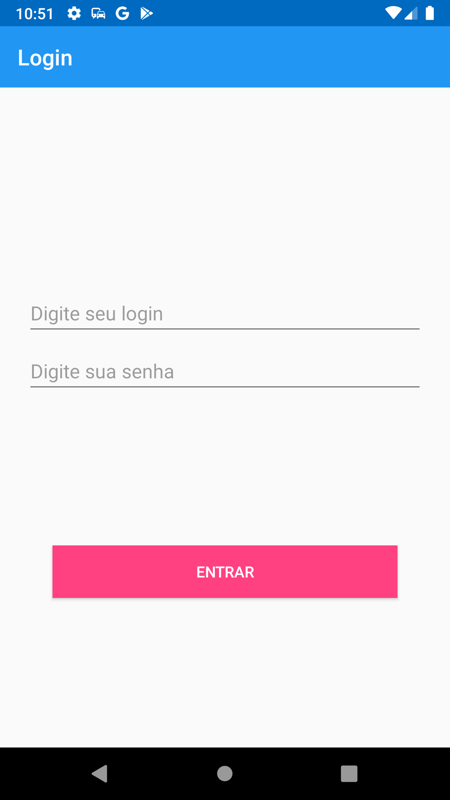

# Aulas Mobile

Compilado dos projetos desenvolvidos durante as aulas de Programação Mobile na FATEC Taubaté.

## Getting Started

### MENU/NAVEGAÇÃO

NavigationDrawer utilizado para navegar entre os fragmentts utilizados no projeto
    (Controlado pela BaseActivity, necessário utilizar os métodos
    SetUpToolbar() e SetUpNavDrawer()
    para utilizar o menu corretamente)

### LOGIN

#### 1.1 - LoginActivity

Página de login que inicia a página de validação via onClick após ter os dados preenchidos

#### 1.2 - ValidatorActivity
Página de validação, inicia a MainActivity após validar os dados (após 300 milissegundos) 

### MAPS

#### MapsFragment
Fragment uttilizado para mostrar o mapa com marcador com nome e local definido pelo usuário
(Necessário criar uma API KEY no console)

### CALCULADORA

#### CalculadoraFrag
Fragment utilizado para o projeto da calculadora

### SQLITE

#### DatabaseFrag
Fragment utilizado para a demonstração do funcionamento do SQLite
    (com um spinner para seleção dos itens salvos, 
    e utilização de um toast para exibir o item selecionado)
    

